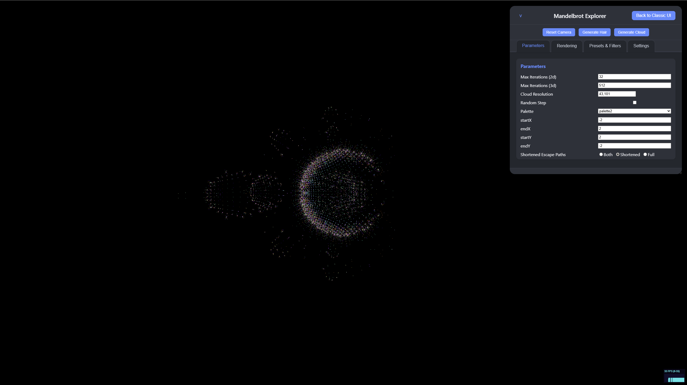

# Mandelbrot Explorer

[](https://github.com/jparish1977/mandelbrotexplorer/actions/workflows/check.yml)

Interactive Mandelbrot and Julia set explorer with 2D canvas rendering, 3D particle visualization, and GPU-accelerated computation.



**[Live Demo — iteration8.com](https://iteration8.com)** | [GitHub Pages mirror](https://jparish1977.github.io/mandelbrotexplorer/)

 ## Try the Mandelbrot DEMO **[Try it now](https://mandelbrotexplorer.netlify.app)**

## Features

- **2D + 3D visualization** — classic top-down Mandelbrot rendering and interactive 3D escape-path particles via Three.js
- **GPU acceleration** — WebGL shaders compute escape paths in parallel, 2-10x faster than CPU
- **Julia set mode** — explore Julia sets with configurable c parameter
- **Dual UI** — classic control panel and modern tabbed interface with CodeMirror code editor
- **Color palettes** — multiple gradient schemes with real-time palette cycling
- **Presets** — save and load exploration states
- **Settings persistence** — auto-saves your session to localStorage

## Quick Start

Open `index.html` in a browser. No build step, no server required.

Or visit **[iteration8.com](https://iteration8.com)**.

## Technology

- Vanilla JavaScript (no frameworks)
- [Three.js](https://threejs.org/) r78 for 3D rendering
- WebGL 1.0/2.0 for GPU computation
- [CodeMirror](https://codemirror.net/) 5 for the code editor UI
- Canvas 2D API for fractal rendering

## Architecture

```
index.html                  Entry point
mandelbrotexplorer.js       Core properties, init, 2D rendering, color cycling, math
gpuAcceleration.js          WebGL shaders, GPU escape paths, CPU fallback
cloudMethods.js             Eval wrappers, scene setup, cache management
cloudGeneration.js          Particle generation, hair rendering
uiHandlers.js               Update, toggle, and preset setter handlers
ui.js                       Init, render loop, camera, settings, zoom
altUI-*.js                  Modern tabbed UI (5 modules)
threeRenderer.js            Three.js scene management
shaderLoader.js             GLSL shader loading with file:// fallback
gradientline.js             Color gradient generation for 3D lines
palettes.js                 Color palette definitions
presets.js                  Saved exploration presets
settingsManager.js          localStorage persistence
shaders/                    GLSL vertex and fragment shaders
vendor/                     Third-party libraries (Stats.js, TrackballControls.js)
phpbrot.php                 Server-side Mandelbrot renderer (PHP/GD)
```

## Documentation

Detailed architecture notes are in the [docs/](docs/) directory:

- [Alt UI Modularization](docs/ALTUI_MODULARIZATION.md)
- [GPU Acceleration](docs/GPU_ACCELERATION.md)
- [Cloud Generation](docs/CLOUD_GENERATION_IMPROVEMENTS.md)
- [Shader Separation](docs/SHADER_SEPARATION.md)

## License

MIT
